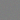
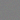
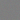
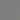
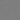
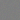
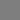
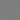
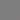

# Applying Schrödinger Bridge Methods to Generative Modeling of Time Series

## Acknowledgements
This repository builds on the code and methodology proposed by Hamdouche, Mohamed, Henry-Labordere, Pierre, and Pham, Huyen in their paper "Generative Modelling for Time Series Via Schrödinger Bridge" (7 April 2023). The original paper and code serves as the basis for the implementation and experiments carried out in this project.

## Introduction
This repository presents an implementation of the Schrödinger Bridge (SB) approach to generative modelling of financial time series. The SB method provides a novel framework for modelling time series data, using entropic interpolation via optimal transport to capture, for example, the temporal dynamics of financial markets or to generate images. 

## Example

Here is an example of how an RGB image is generated using the SBTS.
These animations were generated using a step parameter for the initial part of the data (i.e. skipping every mth step), but no frames were skipped in the last 100 frames.

<table>
  <tr>
    <td></td>
    <td></td>
    <td></td>
  </tr>
  <tr>
    <td></td>
    <td></td>
    <td></td>
  </tr>
  <tr>
    <td></td>
    <td></td>
    <td></td>
  </tr>
</table>

## Implementation details
The code provided here is for e.g. financial time series data. It implements the SB approach described in the literature and provides functionality to estimate the drift function from historical data samples and to simulate synthetic time series data.

### Notebooks
- `onedim.ipynb`: Notebook for one-dimensional financial time series data, such as stock prices or index returns.
- `multidim.ipynb`: Notebook for multidimensional financial time series data, such as image sequences or high-dimensional market data.

## Performance evaluation
The performance of the generative model is evaluated through various experiments on financial datasets, assessing metrics such as accuracy, robustness and applicability to real-world scenarios.

## Master's Thesis
This project is part of a master's thesis titled "Applying Schrödinger Bridge Methods to Generative Modeling of Time Series" The thesis aims to explore the effectiveness and practical implications of SB methods in data generation.

## Citation
If you find this code useful for your research, please consider citing the original paper that inspired this work:
Hamdouche, Mohamed, Henry-Labordere, Pierre, and Pham, Huyen. "Generative Modeling for Time Series Via Schrödinger Bridge" (April 7, 2023). Available at SSRN: https://ssrn.com/abstract=4412434 or http://dx.doi.org/10.2139/ssrn.4412434

